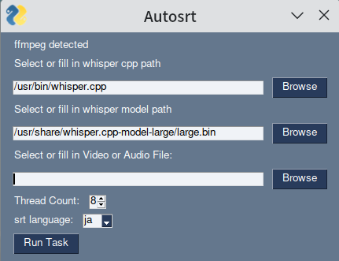

# Autosrt

Powered by PySimpleGUI, whisper.cpp. Mostly written by chatGPT.

1. install [ffmpeg](https://ffmpeg.org/download.html) on your computer.
2. download whisper.cpp 
   1. windows user: https://github.com/ggerganov/whisper.cpp/releases, download whisper-bin-x64.zip (or win32), select `main.exe` as whisper cpp path.
   2. macos/linux user: build from source code.
3. download model from <https://huggingface.co/ggerganov/whisper.cpp/tree/main>
4. run main.py, and wait. If you want, you can use `tmux` to run it in the bg.

main code prompt

> use pysimplegui write a gui for me, it has a file browser to choose video file or audio file, and some text input box to input name, a number box to input thread count, a button to run the task, a drop down to choose language.

## ScreenShot

## Video

[video.webm](https://user-images.githubusercontent.com/30024051/231856412-eeb0998d-6461-44a3-96d9-2b713a1029c9.webm)

then text will be print out to shell, and finally return a srt in the directory.
